<!-----

You have some errors, warnings, or alerts. If you are using reckless mode, turn it off to see inline alerts.
* ERRORs: 0
* WARNINGs: 0
* ALERTS: 17

Conversion time: 5.994 seconds.

Using this Markdown file:

1. Paste this output into your source file.
2. See the notes and action items below regarding this conversion run.
3. Check the rendered output (headings, lists, code blocks, tables) for proper
   formatting and use a linkchecker before you publish this page.

Conversion notes:

* Docs to Markdown version 1.0β36
* Wed May 15 2024 12:02:47 GMT-0700 (PDT)
* Source doc: ReadMe_INST767_Team6_ercot_grid_weather_data_analysis
* This document has images: check for >>>>>  gd2md-html alert:  inline image link in generated source and store images to your server. NOTE: Images in exported zip file from Google Docs may not appear in  the same order as they do in your doc. Please check the images!

----->

>>>>>  gd2md-html alert:  ERRORs: 0; WARNINGs: 0; ALERTS: 17.

<ul style="color: red; font-weight: bold"><li>See top comment block for details on ERRORs and WARNINGs. <li>In the converted Markdown or HTML, search for inline alerts that start with >>>>>  gd2md-html alert:  for specific instances that need correction.</ul>

Links to alert messages:
<a href="#gdcalert1">alert1</a>
<a href="#gdcalert2">alert2</a>
<a href="#gdcalert3">alert3</a>
<a href="#gdcalert4">alert4</a>
<a href="#gdcalert5">alert5</a>
<a href="#gdcalert6">alert6</a>
<a href="#gdcalert7">alert7</a>
<a href="#gdcalert8">alert8</a>
<a href="#gdcalert9">alert9</a>
<a href="#gdcalert10">alert10</a>
<a href="#gdcalert11">alert11</a>
<a href="#gdcalert12">alert12</a>
<a href="#gdcalert13">alert13</a>
<a href="#gdcalert14">alert14</a>
<a href="#gdcalert15">alert15</a>
<a href="#gdcalert16">alert16</a>
<a href="#gdcalert17">alert17</a>

>>>>> PLEASE check and correct alert issues and delete this message and the inline alerts.

**ReadMe file for INST767_Project_Team-6 Ercot and weather Energy Data Lake**

Summary: Our Data pipeline ingests data from 5 APIs and loads as it is in cloud storage. Our workflow executes the relevant Pyspark jobs to pick up all the files in the cloud storage, transform the data to represent correct data types, removes nulls, duplicates, merged data where required, to populate the corresponding Big Query tables.

**ELT Diagram:**

>>>>>  gd2md-html alert: inline image link here (to images/image1.png). Store image on your image server and adjust path/filename/extension if necessary.  (<a href="#">Back to top</a>)(<a href="#gdcalert2">Next alert</a>) >>>>> 

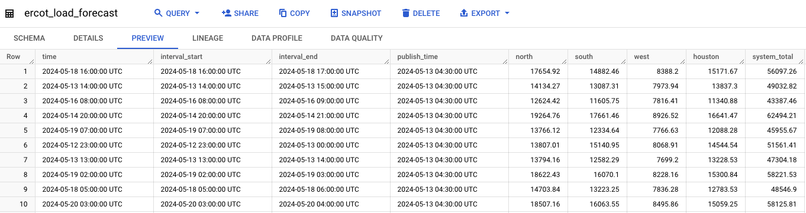

**Step1**: We created Storage Buckets to hold incoming data. Our data storage bucket is named ercot_test. It is structured to hold incoming CSV files into respective folders. The structure is available in the image below.

>>>>>  gd2md-html alert: inline image link here (to images/image2.png). Store image on your image server and adjust path/filename/extension if necessary.  (<a href="#">Back to top</a>)(<a href="#gdcalert3">Next alert</a>) >>>>> 

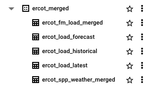

**Step 2**: We created cloud functions that access data and save to the respective folders.

Our Cloud Functions:

We have 5 cloud functions to pull in data applying the following 4 methods on the gridstatus iso

iso =  gridstatus.Ercot()

1. get_fuel_mix(),
2. get_load(), (Source for 2 functions, one for load_latest and one for load_historical)
3. get_load_forecast()
4. Weather

Additionally, we created two more cloud functions that loads historical data upto the past 6 months:

* Ercot_load_historical_6m: This cloud function fetches the load information from ERCOT for the last 6 months and stores it in a bucket. 
* Store_hourly_hist_weather_6m: Similarly, this cloud function fetches the historical weather data from the last 6 months and stores it in a bucket.

>>>>>  gd2md-html alert: inline image link here (to images/image3.png). Store image on your image server and adjust path/filename/extension if necessary.  (<a href="#">Back to top</a>)(<a href="#gdcalert4">Next alert</a>) >>>>> 

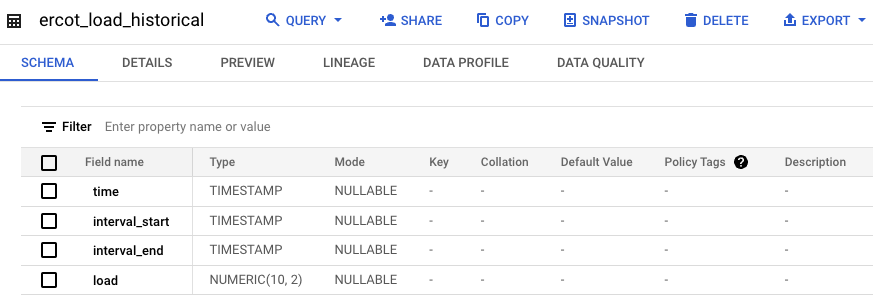

**Step 3**: We created Spark jobs that took the csv files, applied transformations such as

1. Reading all the existing files in the folder and merging them into a single dataframe
2. Transforming column names by replacing spaces with ‘_’ to suit updation to Bigquery
3. The schema of the csv files was interpreted as strings by Pyspark. Therefore, we applied relevant transformations to correct the schema
4. We corrected float numbers to 2 decimal places
5. We deleted Nulls
6. We iterated over all the CSV files in the source buckets, copying each one into an archive folder, before removing them from their original locations.
7. Basic logging is also implemented to capture information such as the dataframe's shape and the presence of null values. These logging statements are helpful for debugging, monitoring the execution flow and understanding the data being transformed
8. For the one pipeline that merges fuel mix and load data, we matched the data on the ‘Time’ column and removed only non-null rows

We saved the spark jobs code to our code storage bucket named store_dataproc_files. We have a code_notebooks folder in it, wherein we have the final_code folder which has Pyspark_code and cloud_functions code subfolders.  Its structure is as follows

>>>>>  gd2md-html alert: inline image link here (to images/image4.png). Store image on your image server and adjust path/filename/extension if necessary.  (<a href="#">Back to top</a>)(<a href="#gdcalert5">Next alert</a>) >>>>> 

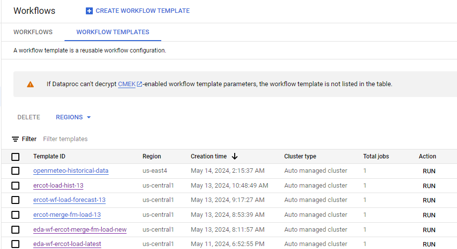

**Step4: **We then created Dataproc-Workflows, to create 4 distinct pipelines. They are:

1. eda-wf-ercot-load-forecast -13: Executes the pyspark job related to reading all the files in the ercot_ load_corecast_csv folder, merging them into a single dataframe, apply transformations, update to bigquery and then move all the files to an archive. 
2. ercot-load-hist-13: Executes the pyspark job related to reading all the files in the ercot_ load_csv/fm_historical folder, merging them into a single dataframe, apply transformations, update to bigquery and then move all the files to an archive. 
3. ercot-merge-fm-load-13 : Executes the pyspark job related to reading all the files in the ercot_ load_csv/load_latest and ercot_fm_csv/fm_latest  folder, merging them into a single dataframe, apply transformations, update to bigquery and then move all the files to an archive. 
4. Eda-wf-ercot-load-latest: Executes the pyspark job related to reading all the files in the ercot_ load_csv/load_latestl folder, merging them into a single dataframe, apply transformations, update to bigquery and then move all the files to an archive. 
5. Workflow-spp-weather-merge : Executes the pyspark job which reads all the files in spp_latest folder that contains all the prices of fuels in 4 zones and quarter_hourly_weather_data folder that contains the weather data for the 4 zones. It then cleans and joins the two datasets on the location column(zones) and the time column.
6. mergeHistoricalWeather.py : This pyspark job merges all the historical weather data that is fetched from the OpenMeteo API.
7. pyspark_ercot_load_latest_BQ_archive_csv : Executes the pyspark job that reads all csv files from load_latest folder, merges them, transforms datatypes, updates big query table, archives the files and deletes from source folder. 

>>>>>  gd2md-html alert: inline image link here (to images/image5.png). Store image on your image server and adjust path/filename/extension if necessary.  (<a href="#">Back to top</a>)(<a href="#gdcalert6">Next alert</a>) >>>>> 

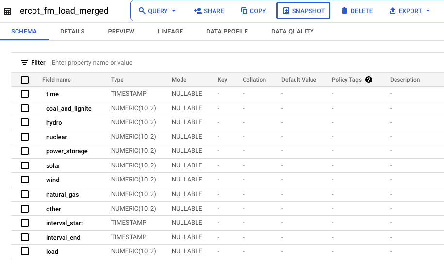

**Strategy adopted for ensuring only new files get updated to BigQuery:** Instead of fetching specific files from the bucket for the dataproc job to process, we decided to process all the files present in the bucket, and upon finishing execution, moved all the files into the archive folder. 

We then created Cloud schedulers and scheduled them using cron jobs, for the cloud functions and the dataproc cluster jobs to run at regular intervals.

>>>>>  gd2md-html alert: inline image link here (to images/image6.png). Store image on your image server and adjust path/filename/extension if necessary.  (<a href="#">Back to top</a>)(<a href="#gdcalert7">Next alert</a>) >>>>> 

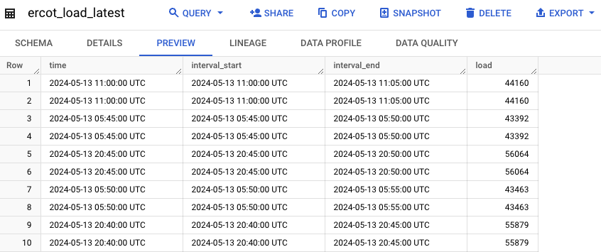

**List of cloud schedulers, the tasks they perform and the frequency of execution:**

1. **eda-wf-ercot-load-forecast** : This scheduler executes _ercot load historical workflow_ every 12 hours, at the zeroth minute, every day of the month, every month.
2. **eda-wf-ercot-load-hist :** This scheduler executes _ercot-load-hist-wf_ once every 12 hours at the zeroth minute, every day of the month, every month.
3. **eda-wf-ercot-merge-fm-load **: This scheduler executes the _ercot merge fuel mix and load latest workflow _every 12 hours at the zeroth minute, every day of the month, every month..
4. **ercot-fm-latest** : This scheduler executes the ercot_fm_latest_csv _cloud function, once_ every hour after 15 minutes, every day of the month, every month.
5. **ercot-load-historical **: This scheduler executes the ercot_load_historical_csv _cloud function _every 1 hour at the zeroth minute, every day of the month, every month.
6. **ercot-load-latest **: This scheduler executes the ercot_load_latest_csv _cloud function _every hour after 15 minutes, every day of the month, every month.
7. **ercot_load_forecast **: This scheduler executes the ercot_load_forecast_csv _cloud function every hour after _15 minutes, every day of the month, every month.
8. **Quarter_hourly_spp_csv** : Scheduler that calls the ercot_spp_csv function every 15 minutes, every hour, every day of the month, every month.
9. **Quater_hourly_weather** : Scheduler that calls the open_weather_live_data function every 15 minutes.
10. **Sparkjob-spp-weather-merge **: Scheduler that calls the spark job that merges the spp price dataset along with the weather dataset every 12 hours.

Storage: After all the processing is done, data is pushed into a table in BigQuery.

>>>>>  gd2md-html alert: inline image link here (to images/image7.png). Store image on your image server and adjust path/filename/extension if necessary.  (<a href="#">Back to top</a>)(<a href="#gdcalert8">Next alert</a>) >>>>> 

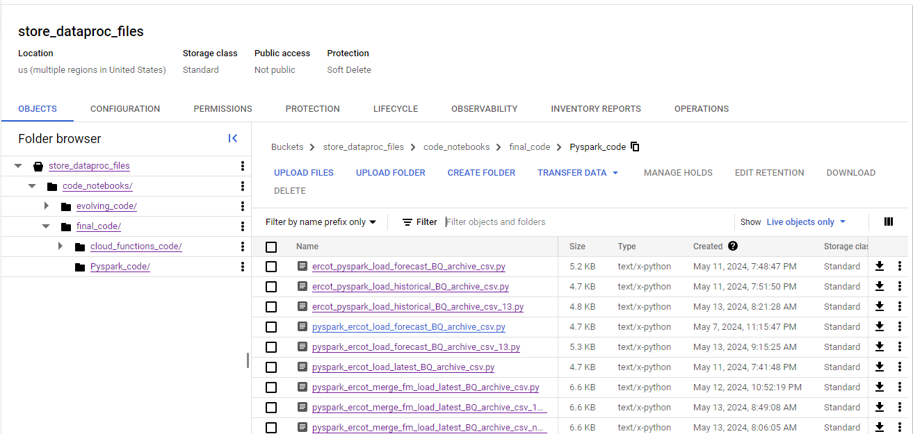

Ercot_fm_load_merged: 

>>>>>  gd2md-html alert: inline image link here (to images/image8.png). Store image on your image server and adjust path/filename/extension if necessary.  (<a href="#">Back to top</a>)(<a href="#gdcalert9">Next alert</a>) >>>>> 

>>>>>  gd2md-html alert: inline image link here (to images/image9.png). Store image on your image server and adjust path/filename/extension if necessary.  (<a href="#">Back to top</a>)(<a href="#gdcalert10">Next alert</a>) >>>>> 

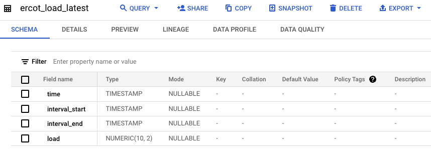

Ercot_load_forecast: 

>>>>>  gd2md-html alert: inline image link here (to images/image10.png). Store image on your image server and adjust path/filename/extension if necessary.  (<a href="#">Back to top</a>)(<a href="#gdcalert11">Next alert</a>) >>>>> 

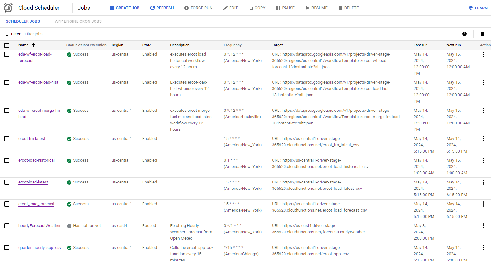

>>>>>  gd2md-html alert: inline image link here (to images/image11.png). Store image on your image server and adjust path/filename/extension if necessary.  (<a href="#">Back to top</a>)(<a href="#gdcalert12">Next alert</a>) >>>>> 

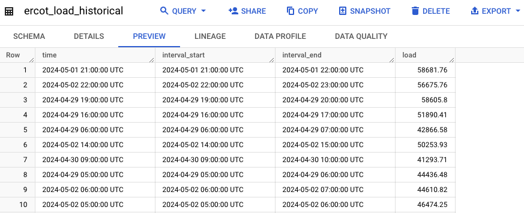

Ercot_load_historical:

>>>>>  gd2md-html alert: inline image link here (to images/image12.png). Store image on your image server and adjust path/filename/extension if necessary.  (<a href="#">Back to top</a>)(<a href="#gdcalert13">Next alert</a>) >>>>> 

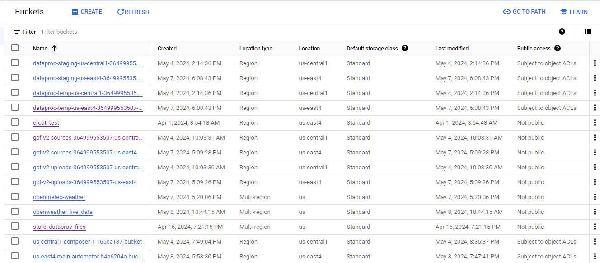

>>>>>  gd2md-html alert: inline image link here (to images/image13.png). Store image on your image server and adjust path/filename/extension if necessary.  (<a href="#">Back to top</a>)(<a href="#gdcalert14">Next alert</a>) >>>>> 

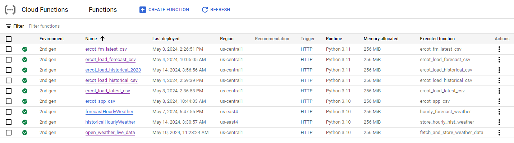

Ercot_load_latest: 

>>>>>  gd2md-html alert: inline image link here (to images/image14.png). Store image on your image server and adjust path/filename/extension if necessary.  (<a href="#">Back to top</a>)(<a href="#gdcalert15">Next alert</a>) >>>>> 

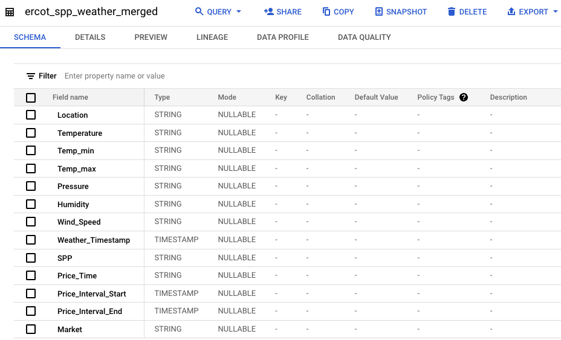

>>>>>  gd2md-html alert: inline image link here (to images/image15.png). Store image on your image server and adjust path/filename/extension if necessary.  (<a href="#">Back to top</a>)(<a href="#gdcalert16">Next alert</a>) >>>>> 

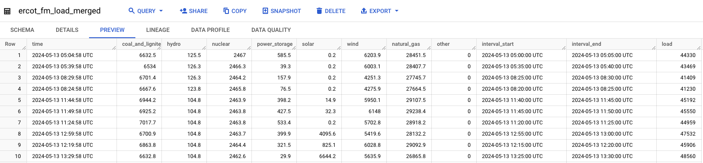

Ercot_spp_weather_merged: 

>>>>>  gd2md-html alert: inline image link here (to images/image16.png). Store image on your image server and adjust path/filename/extension if necessary.  (<a href="#">Back to top</a>)(<a href="#gdcalert17">Next alert</a>) >>>>> 

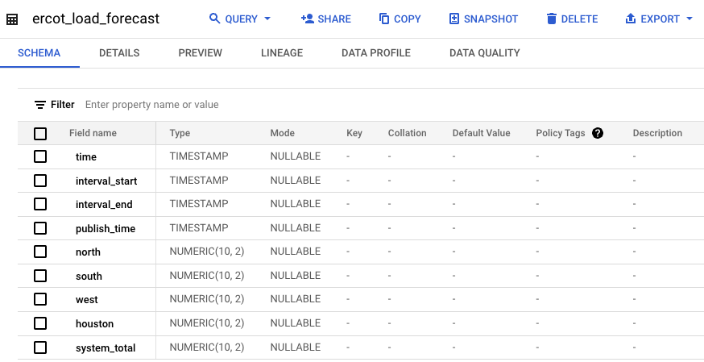

>>>>>  gd2md-html alert: inline image link here (to images/image17.png). Store image on your image server and adjust path/filename/extension if necessary.  (<a href="#">Back to top</a>)(<a href="#gdcalert18">Next alert</a>) >>>>> 

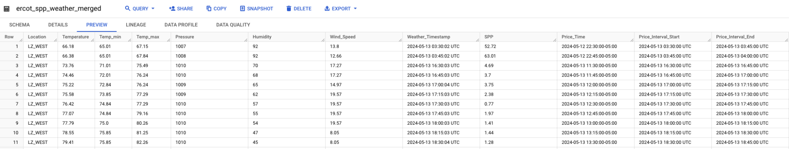

Analysis: \
We used the following queries to fetch data from the BigQuery and answer the following business questions, which we then used Google looker to visualize.
